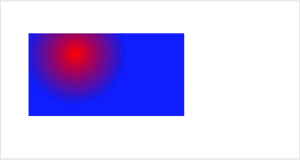
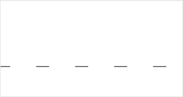
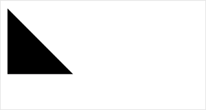
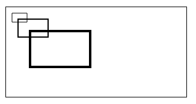
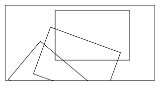
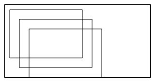
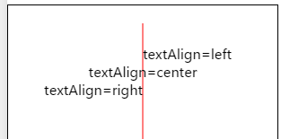
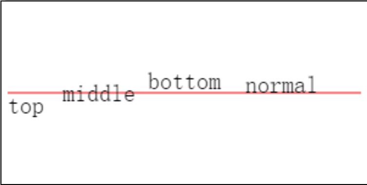
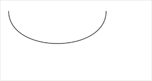
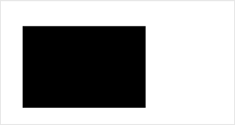

**解释：**canvas 画布，可使用 JS 操作 canvas 上下文，发出指令，进行绘制。

**SWAN模板写法示例：**

```xml
<canvas canvas-id="myCanvas" />
```

**JS写法示例：**

```js
Page({
    onReady: function () {
        const ctx = this.createCanvasContext('myCanvas');
        ctx.setFillStyle('#ff0000');
        ctx.arc(100, 100, 50, 0, 2 * Math.PI);
        ctx.fill();
        ctx.draw();
    }
});
```

我们来回顾一下，刚刚都执行了哪些指令：

**1、创建绘图上下文**

推荐使用 Page 对象上挂载的`createCanvasContext`方法，进行绘制上下文的创建：

```js
Page({
    onReady: function () {
        const ctx = this.createCanvasContext('myCanvas');
	}
});

```

当然，也可以使用 SWAN 上挂载的`createCanvasContext`方法。
如下，我们调用 SWAN 的接口`createCanvasContext`创建了一个绘制上下文（但请注意，使用 SWAN 上挂载的`createCanvasContext`，会在当前用户可见的 Page 中寻找`canvas`）。

```js
const ctx = swan.createCanvasContext('myCanvas');
```

**2、发送绘制指令**

设置颜色，并画一个圆，填充。

```js
ctx.setFillStyle('#ff0000');

ctx.arc(100, 100, 50, 0, 2 * Math.PI);
ctx.fill();
```

**3、绘制**
执行上面已经发出的指令，进行 canvas 绘制。

```js
ctx.draw();
```


## 坐标系


canvas 坐标系，以左上角为(0, 0)，横轴为 x，纵轴为 y。
如：`ctx.arc(100, 200, 50, 0, 2 * Math.PI);`命令，就是在`x: 100, y: 200`为圆心处，开始画圆。


## swan.createCanvasContext


**解释：**在 Page 中，推荐使用`this.createCanvasContext(canvasId)`，进行绘图上下文的创建。也可使用`swan.createCanvasContext(canvasId)`，但使用`swan.createCanvasContext(canvasId)`进行创建时，并非在执行所在的 Page 对象中使用 canvasId 进行查找，而是在用户当前可视的 Page 中使用 canvasId 进行查找。

**方法参数：**String canvasId


## swan.canvasGetImageData


**解释：**返回一个数组，用来描述 canvas 区域隐含的像素数据。在自定义组件下，第二个参数传入自定义组件组件实例 this，以操作组件内 `<canvas>` 组件。

**Object 参数：**

**方法参数：**Object object

**`object`参数说明：**

|参数名 |类型  |必填 | 默认值 |说明|
|---- | ---- | ---- | ----|----|
|canvasId	| String | 是  | 画布标识，传入 `<canvas>` 组件的 canvas-id 属性。|
|x	| Number | 是  | 将要被提取的图像数据矩形区域的左上角横坐标 |
|y	| Number | 是  | 将要被提取的图像数据矩形区域的左上角纵坐标 |
|width	| Number | 是  | 将要被提取的图像数据矩形区域的宽度|
|height	| Number | 是  | 将要被提取的图像数据矩形区域的高度 |
|success	| Function | 否  | 接口调用成功的回调函数 |
|fail	| Function | 否  | 接口调用失败的回调函数 |
|complete	| Function | 否  | 接口调用结束的回调函数（调用成功、失败都会执行）|

**success返回参数说明：**

|参数  |类型|说明 |
|---- | ---- |---- |
|width|number|图像数据矩形的宽度|
|height|number|图像数据矩形的高度|
|data|Uint8ClampedArray|图像像素点数据，一维数组，每四项表示一个像素点的rgba|

OBJECT this
自定义组件实例

**示例：**

```js
swan.canvasGetImageData({
    canvasId: 'myCanvas',
    x: 0,
    y: 0,
    width: 100,
    height: 100,
    success(res) {
        console.log(res);
    }
});
```
<!-- #### 错误码 -->


<!-- |错误码|说明|
|--|--|
|201|解析失败，请检查调起协议是否合法|
|202|解析失败，请检查参数是否正确。| -->

## swan.canvasPutImageData


**解释：**将像素数据绘制到画布的方法。在自定义组件下，第二个参数传入自定义组件实例 this，以操作组件内 `<canvas>` 组件。

**方法参数：**Object object

**`object`参数说明：**

|参数名 |类型  |必填 | 默认值 |说明|
|---- | ---- | ---- | ----|----|
|canvasId	| String | 是  | 画布标识，传入 `<canvas> `组件的 canvas-id 属性。|
|x	| Number | 是  | 将要被提取的图像数据矩形区域的左上角横坐标 |
|y	| Number | 是  | 将要被提取的图像数据矩形区域的左上角纵坐标 |
|width	| Number | 是  | 将要被提取的图像数据矩形区域的宽度|
|height	| Number | 是  | 将要被提取的图像数据矩形区域的高度 |
|data	| Uint8ClampedArray | 是  | 图像像素点数据，一维数组，每四项表示一个像素点的 rgba |
|success	| Function | 否  | 接口调用成功的回调函数 |
|fail	| Function | 否  | 接口调用失败的回调函数 |
|complete	| Function | 否  | 接口调用结束的回调函数（调用成功、失败都会执行）|

**示例：**

```js
swan.canvasGetImageData({
            canvasId: 'myCanvas',
            x: 0,
            y: 0,
            width: 100,
            height: 100,
            success(res) {
                swan.canvasPutImageData({
                    canvasId: 'myCanvas',
                    x: 0,
                    y: 0,
                    width: 100,
                    data: res.data,
                    success(res) {
                        console.log('success');
                    },
                    fail(err) {
                        console.log('err');
                    },
                    complete() {
                        console.log('complete');
                    }
                });
            }
        });
```
<!-- #### 错误码


|错误码|说明|
|--|--|
|201|解析失败，请检查调起协议是否合法。|
|1001|执行失败|
|202|解析失败，请检查参数是否正确。| -->

## swan.canvasToTempFilePath


**解释：**把当前画布指定区域的内容导出生成指定大小的图片，并返回文件路径。在自定义组件下，第二个参数传入组件实例`this`，以操作组件内`<canvas/>`组件。

**方法参数：**Object object

**`object`参数说明：**

|参数名 |类型  |必填 | 默认值 |说明|
|---- | ---- | ---- | ----|----|
|x	| Number | 否  | 画布 x 轴起点（默认 0 ）|
|y	| Number | 否  | 画布 y 轴起点（默认 0 ）|
|width	| Number | 否  | 画布宽度（默认为 canvas 宽度 -x）|
|height	| Number | 否  | 画布高度（默认为 canvas 高度 -y）|
|destWidth	| Number | 否  | 输出图片宽度（默认为 width * 屏幕像素密度）|
|destHeight	| Number | 否  | 输出图片高度（默认为 height * 屏幕像素密度）|
|canvasId	| String | 是  | 画布标识，传入`<canvas/>`的 canvas-id|
|fileType	| String | 否  | 目标文件的类型，只支持 'jpg' 或 'png'，默认为 'png' 。|
|quality	| Number | 否  | 图片的质量，取值范围为 (0, 1]，不在范围内时当作 1.0 处理 。|
|success	| Function | 否  | 接口调用成功的回调函数 |
|fail	| Function | 否  | 接口调用失败的回调函数 |
|complete	| Function | 否  | 接口调用结束的回调函数（调用成功、失败都会执行）|

**说明：**

在 draw 回调里调用该方法才能保证图片导出成功。

**示例：**

```js
swan.canvasToTempFilePath({
    x: 100,
    y: 200,
    width: 50,
    height: 50,
    destWidth: 100,
    destHeight: 100,
    canvasId: 'myCanvas',
    success: function(res) {
        console.log(res.tempFilePath)
    }
});
```
<!-- #### 错误码 -->


<!-- |错误码|说明|
|--|--|
|201|解析失败，请检查调起协议是否合法。|
|1001|执行失败|
|202|解析失败，请检查参数是否正确。| -->

## swan.canvasContext.setFillStyle


**解释：**设置填充色。

**方法参数：** Color color


**示例：**

```js
const ctx = this.createCanvasContext('myCanvas');
ctx.setFillStyle('blue');
ctx.fillRect(30, 30, 150, 75);
ctx.draw();
```


## swan.canvasContext.setStrokeStyle


**解释：**设置边框颜色。

**方法参数：** Color color

**示例：**

```js
const ctx = this.createCanvasContext('myCanvas');
ctx.setStrokeStyle('blue');
ctx.strokeRect(30, 30, 150, 75);
ctx.draw();
```


## swan.canvasContext.setShadow

**解释：**设置阴影样式。

**方法参数：**Object object

**`object`参数说明：**

|参数名 |类型  |必填 | 默认值 |说明|
|---- | ---- | ---- | ----|----|
| offsetX | Number | 是| 阴影相对于形状在水平方向的偏移 |
| offsetY | Number |是 | 阴影相对于形状在竖直方向的偏移 |
| blur | Number | 是 | 阴影的模糊级别，数值越大越模糊，范围：0 ~ 100。 |
| color	| Color | 是| 阴影的颜色 |

**示例：**

```js
const ctx = swan.createCanvasContext('myCanvas');
ctx.setFillStyle('blue');
ctx.setShadow(10, 50, 50, 'red');
ctx.fillRect(30, 30, 150, 75);
ctx.draw();
```


## swan.canvasContext.createLinearGradient


**解释：**创建一个线性的渐变颜色。

**方法参数：**Number x0，Number y0，Number x1，Number y1

**`x0`参数说明**：起点的 x 坐标

**`y0`参数说明**：起点的 y 坐标

**`x1`参数说明**：阴影的模糊级别，数值越大越模糊。

**`y1`参数说明**：阴影的颜色


**示例：**

```js
const ctx = this.createCanvasContext('myCanvas');

// Create linear gradient
const grd = ctx.createLinearGradient(0, 0, 200, 0);
grd.addColorStop(0, 'blue');
grd.addColorStop(1, 'red');

// Fill with gradient
ctx.setFillStyle(grd);
ctx.fillRect(30, 30, 150, 80);
ctx.draw();
```


## swan.canvasContext.createCircularGradient

**解释：**创建一个圆形的渐变颜色。

**方法参数：**Number x，Number y，Number z

**`x`参数说明：**圆心的 x 坐标

**`y`参数说明：**圆心的 y 坐标

**`z`参数说明：**圆的半径


**示例：**

```js
const ctx = swan.createCanvasContext('myCanvas');

// Create circular gradient
const grd = ctx.createCircularGradient(75, 50, 50);
grd.addColorStop(0, 'red');
grd.addColorStop(1, 'blue');

// Fill with gradient
ctx.setFillStyle(grd);
ctx.fillRect(30, 30, 150, 80);
ctx.draw();
```



## swan.canvasContext.addColorStop


**解释：**创建一个颜色的渐变点。

**方法参数：**Number(0-1) stop,Color color

**`stop`参数说明：**表示渐变点在起点和终点中的位置，取值(0-1)。

**`color`参数说明:**渐变点的颜色


**示例：**

```js
const ctx = swan.createCanvasContext('myCanvas');

// Create circular gradient
const grd = ctx.createLinearGradient(30, 10, 120, 10);
grd.addColorStop(0, 'red');
grd.addColorStop(0.16, 'orange');
grd.addColorStop(0.33, 'yellow');
grd.addColorStop(0.5, 'green');
grd.addColorStop(0.66, 'cyan');
grd.addColorStop(0.83, 'blue');
grd.addColorStop(1, 'purple');

// Fill with gradient
ctx.setFillStyle(grd);
ctx.fillRect(30, 30, 150, 80);
ctx.draw();
```


**说明：**
addColorStop 目前在 Android 有bug。

## swan.canvasContext.setLineWidth


**解释：**设置线条的宽度。

**方法参数：**Number lineWidth

**`lineWidth`参数说明：**线条的宽度(单位是 px)

**示例：**

```js
const ctx = swan.createCanvasContext('myCanvas');
ctx.beginPath();
ctx.moveTo(30, 10);
ctx.lineTo(200, 10);
ctx.stroke();

ctx.beginPath();
ctx.setLineWidth(5);
ctx.moveTo(50, 30);
ctx.lineTo(200, 30);
ctx.stroke();

ctx.beginPath();
ctx.setLineWidth(10);
ctx.moveTo(70, 50);
ctx.lineTo(200, 50);
ctx.stroke();

ctx.beginPath();
ctx.setLineWidth(15);
ctx.moveTo(90, 70);
ctx.lineTo(200, 70);
ctx.stroke();

ctx.draw();
```


## swan.canvasContext.setLineCap

**解释：**设置线条的端点样式。

**方法参数：**String lineCap

**`lineCap`参数说明：**取值范围：'butt'、'round'、'square', 线条的结束端点样式。

**示例：**

```js
const ctx = swan.createCanvasContext('myCanvas');
ctx.beginPath();
ctx.moveTo(30, 10);
ctx.lineTo(200, 10);
ctx.stroke();

ctx.beginPath();
ctx.setLineCap('butt');
ctx.setLineWidth(10);
ctx.moveTo(50, 30);
ctx.lineTo(200, 30);
ctx.stroke();

ctx.beginPath();
ctx.setLineCap('round');
ctx.setLineWidth(10);
ctx.moveTo(70, 50);
ctx.lineTo(200, 50);
ctx.stroke();

ctx.beginPath();
ctx.setLineCap('square');
ctx.setLineWidth(10);
ctx.moveTo(90, 70);
ctx.lineTo(200, 70);
ctx.stroke();

ctx.draw();
```


## swan.canvasContext.setLineJoin


**解释：**设置线条的交点样式。

**方法参数：**String lineJoin

**`lineJoin`参数说明：**取值范围：'bevel'、'round'、'miter'， 线条的结束交点样式。  

**示例：**

```js
const ctx = swan.createCanvasContext('myCanvas');
ctx.beginPath();
ctx.moveTo(10, 10);
ctx.lineTo(100, 50);
ctx.lineTo(10, 90);
ctx.stroke();

ctx.beginPath();
ctx.setLineJoin('bevel');
ctx.setLineWidth(10);
ctx.moveTo(50, 10);
ctx.lineTo(140, 50);
ctx.lineTo(50, 90);
ctx.stroke();

ctx.beginPath();
ctx.setLineJoin('round');
ctx.setLineWidth(10);
ctx.moveTo(90, 10);
ctx.lineTo(180, 50);
ctx.lineTo(90, 90);
ctx.stroke();

ctx.beginPath();
ctx.setLineJoin('miter');
ctx.setLineWidth(10);
ctx.moveTo(130, 10);
ctx.lineTo(220, 50);
ctx.lineTo(130, 90);
ctx.stroke();

ctx.draw();
```


## swan.canvasContext.setLineDash

**解释：**设置线条的宽度。

**方法参数：**Array pattern, Number offset

**`pattern`参数说明：**一组描述交替绘制线段和间距（坐标空间单位）长度的数字。 

**`offset`参数说明：**虚线偏移量。

**示例：**

```js
const ctx = swan.createCanvasContext('myCanvas');
ctx.setLineDash([10, 20], 5);
ctx.beginPath();
ctx.moveTo(0,100);
ctx.lineTo(400, 100);
ctx.stroke();
ctx.draw();
```



## swan.canvasContext.setMiterLimit


**解释：**设置最大斜接长度，斜接长度指的是在两条线交汇处内角和外角之间的距离，当 setLineJoin() 为 miter 时才有效，超过最大倾斜长度的，连接处将以 lineJoin 为 bevel 来显示。

**方法参数：** Number miterLimit

**`miterLimit`参数说明:**最大斜接长度  

**示例：**

```js
const ctx = swan.createCanvasContext('myCanvas');
ctx.beginPath();
ctx.setLineWidth(10);
ctx.setLineJoin('miter');
ctx.setMiterLimit(1);
ctx.moveTo(10, 10);
ctx.lineTo(100, 50);
ctx.lineTo(10, 90);
ctx.stroke();

ctx.beginPath();
ctx.setLineWidth(10);
ctx.setLineJoin('miter');
ctx.setMiterLimit(2);
ctx.moveTo(50, 10);
ctx.lineTo(140, 50);
ctx.lineTo(50, 90);
ctx.stroke();

ctx.beginPath();
ctx.setLineWidth(10);
ctx.setLineJoin('miter');
ctx.setMiterLimit(3);
ctx.moveTo(90, 10);
ctx.lineTo(180, 50);
ctx.lineTo(90, 90);
ctx.stroke();

ctx.beginPath();
ctx.setLineWidth(10);
ctx.setLineJoin('miter');
ctx.setMiterLimit(4);
ctx.moveTo(130, 10);
ctx.lineTo(220, 50);
ctx.lineTo(130, 90);
ctx.stroke();

ctx.draw();
```


## swan.canvasContext.rect


**解释：**创建一个矩形。

**方法参数：**Number x, Number y,Number width, Number height

**`x`参数说明：**矩形路径左上角的 x 坐标。

**`y`参数说明：**矩形路径左上角的 y 坐标。

**`width`参数说明：**矩形路径的宽度。

**`height`参数说明：**矩形路径的高度。

**示例：**

```js
const ctx = swan.createCanvasContext('myCanvas');
ctx.rect(30, 30, 150, 75);
ctx.setFillStyle('blue');
ctx.fill();
ctx.draw();
```


## swan.canvasContext.fillRect


**解释：**填充一个矩形。

**方法参数：**Number x, Number y,Number width, Number height

**`x`参数说明：**矩形路径左上角的 x 坐标。

**`y`参数说明：**矩形路径左上角的 y 坐标。

**`width`参数说明：**矩形路径的宽度。

**`height`参数说明：**矩形路径的高度。

**示例：**

```js
const ctx = swan.createCanvasContext('myCanvas');
ctx.setFillStyle('blue');
ctx.fillRect(30, 30, 150, 75);
ctx.draw();
```


## swan.canvasContext.strokeRect


**解释：**画一个矩形(非填充)。

**方法参数：**Number x, Number y,Number width, Number height

**`x`参数说明：**矩形路径左上角的 x 坐标。

**`y`参数说明：**矩形路径左上角的 y 坐标。

**`width`参数说明：**矩形路径的宽度。

**`height`参数说明：**矩形路径的高度。

**示例：**

```js
const ctx = swan.createCanvasContext('myCanvas');
ctx.setStrokeStyle('blue');
ctx.strokeRect(30, 30, 150, 75);
ctx.draw();
```


## swan.canvasContext.clearRect


**解释：**清除画布上在该矩形区域内的内容。

**方法参数：**Number x, Number y,Number width, Number height

**`x`参数说明：**矩形路径左上角的 x 坐标。

**`y`参数说明：**矩形路径左上角的 y 坐标。

**`width`参数说明：**矩形路径的宽度。

**`height`参数说明：**矩形路径的高度。

**示例：**

```js
const ctx = swan.createCanvasContext('myCanvas');
ctx.setFillStyle('red');
ctx.fillRect(0, 0, 150, 200);
ctx.setFillStyle('blue');
ctx.fillRect(150, 0, 150, 200);
ctx.clearRect(30, 30, 150, 75);
ctx.draw();
```


## swan.canvasContext.fill


**解释：**对当前路径中的内容进行填充。默认的填充色为黑色。

**参数：**无

**示例：**

```js
const ctx = swan.createCanvasContext('myCanvas');
ctx.moveTo(100, 100);
ctx.lineTo(10, 100);
ctx.lineTo(10, 10);
ctx.fill();
ctx.draw();
```



## swan.canvasContext.stroke


**解释：**画出当前路径的边框。默认颜色为黑色。

**方法参数：**无

**示例：**

```js
const ctx = swan.createCanvasContext('myCanvas');
ctx.moveTo(100, 100);
ctx.lineTo(10, 100);
ctx.lineTo(10, 10);
ctx.stroke();
ctx.draw();
```


## swan.canvasContext.beginPath


**解释：**开始创建一个路径，需要调用 fill 或者 stroke 才会使用路径进行填充或描边。

**方法参数：**无

**示例：**

```js
const ctx = swan.createCanvasContext('myCanvas');
ctx.rect(10, 10, 100, 30);
ctx.setFillStyle('red');
ctx.fill();
ctx.beginPath();
ctx.rect(10, 40, 100, 30);
ctx.setFillStyle('blue');
ctx.fillRect(10, 70, 100, 30);
ctx.rect(10, 100, 100, 30);
ctx.setFillStyle('green');
ctx.fill();
ctx.draw();
```


## swan.canvasContext.closePath


**解释：**关闭一个路径。

**方法参数：**无

**示例：**

```js
const ctx = swan.createCanvasContext('myCanvas');
ctx.moveTo(100, 100);
ctx.lineTo(10, 100);
ctx.lineTo(10, 10);
ctx.closePath();
ctx.stroke();
ctx.draw();
```


## swan.canvasContext.moveTo


**解释：**把路径移动到画布中的指定点，不创建线条。

**方法参数：**Number x, Number y

**`x`参数说明：**目标位置的 x 坐标

**`y`参数说明：**目标位置的 y 坐标


**示例：**

```js
const ctx = swan.createCanvasContext('myCanvas');
ctx.moveTo(10, 10);
ctx.lineTo(100, 10);
ctx.moveTo(10, 100);
ctx.lineTo(100, 100);
ctx.stroke();
ctx.draw();
```


## swan.canvasContext.lineTo


**解释：**lineTo 方法增加一个新点，然后创建一条从上次指定点到目标点的线。

**方法参数：**Number x, Number y

**`x`参数说明：**目标位置的 x 坐标

**`y`参数说明：**目标位置的 y 坐标

**示例：**

```js
const ctx = swan.createCanvasContext('myCanvas');
ctx.moveTo(10, 10);
ctx.rect(10, 10, 100, 50);
ctx.lineTo(110, 60);
ctx.stroke();
ctx.draw();
```


## swan.canvasContext.arc


**解释：**画一条弧线。

**方法参数：**Number x, Number y, Number r, Number sAngle, Number eAngle, Boolean counterclockwise

**`x`参数说明：**圆的 x 坐标

**`y`参数说明：**圆的 y 坐标

**`r`参数说明：**圆的半径

**`sAngle`参数说明：**起始弧度，单位弧度（在3点钟方向)

**`eAngle`参数说明：**终止弧度

**`counterclockwise`参数说明：**可选。指定弧度的方向是逆时针还是顺时针。默认是 false，即顺时针。


**示例：**

```js
const ctx = swan.createCanvasContext('myCanvas');
ctx.arc(100, 75, 50, 0, 2 * Math.PI);
ctx.setFillStyle('blue');
ctx.fill();
ctx.draw();
```


## swan.canvasContext.scale


**解释：**在调用`scale`方法后，之后创建的路径其横纵坐标会被缩放。多次调用`scale`，倍数会相乘。

**方法参数：**Number scaleWidth, Number scaleHeight

**`scaleWidth`参数说明：**横坐标缩放的倍数 (1 = 100%，0.5 = 50%，2 = 200%) 。

**`scaleHeigh`参数说明：**纵坐标轴缩放的倍数 (1 = 100%，0.5 = 50%，2 = 200%)。


**示例：**

```js
const ctx = swan.createCanvasContext('myCanvas');

ctx.strokeRect(10, 10, 25, 15);
ctx.scale(2, 2);
ctx.strokeRect(10, 10, 25, 15);
ctx.scale(2, 2);
ctx.strokeRect(10, 10, 25, 15);

ctx.draw();
```



## swan.canvasContext.rotate


**解释：**以原点为中心，原点可以用 translate 方法修改。顺时针旋转当前坐标轴。多次调用 rotate，旋转的角度会叠加。

**方法参数：**Number rotate 

**`rotate` 参数说明：**旋转角度，以弧度计(degrees * Math.PI/180；degrees范围为0~360)。


**示例：**

```js
const ctx = swan.createCanvasContext('myCanvas');

ctx.strokeRect(100, 10, 150, 100);
ctx.rotate(20 * Math.PI / 180);
ctx.strokeRect(100, 10, 150, 100);
ctx.rotate(20 * Math.PI / 180);
ctx.strokeRect(100, 10, 150, 100);

ctx.draw();
```



## swan.canvasContext.translate


**解释：**对当前坐标系的原点 (0, 0) 进行变换，默认的坐标系原点为页面左上角。

**方法参数：**Number x, Number y

**`x`参数说明：**水平坐标平移量 

**`y`参数说明：**竖直坐标平移量


**示例：**

```js
const ctx = swan.createCanvasContext('myCanvas');

ctx.strokeRect(10, 10, 150, 100);
ctx.translate(20, 20);
ctx.strokeRect(10, 10, 150, 100);
ctx.translate(20, 20);
ctx.strokeRect(10, 10, 150, 100);

ctx.draw();
```



## swan.canvasContext.clip


**解释：** clip() 方法从原始画布中剪切任意形状和尺寸。一旦剪切了某个区域，则所有之后的绘图都会被限制在被剪切的区域内（不能访问画布上的其他区域）。可以在使用 clip() 方法前通过使用 save() 方法对当前画布区域进行保存，并在以后的任意时间对其进行恢复（通过 “restore()” 方法）。

**方法参数：**无

**示例：**

```js
const ctx = swan.createCanvasContext('myCanvas')

swan.downloadFile({
    url: 'https://b.bdstatic.com/searchbox/icms/searchbox/img/LOGO300x300.jpg',
    success: function(res) {
        ctx.save()
        ctx.beginPath()
        ctx.arc(50, 50, 25, 0, 2*Math.PI)
        ctx.clip()
        ctx.drawImage(res.tempFilePath, 25, 25)
        ctx.restore()
        ctx.draw()
    }
});
```

## swan.canvasContext.setFontSize


**解释：**设置字体的字号。

**方法参数：**Number fontSize

`fontSize`参数说明：字体的字号 


**示例：**

```js
const ctx = swan.createCanvasContext('myCanvas');

ctx.setFontSize(20);
ctx.fillText('20', 20, 20);
ctx.setFontSize(30);
ctx.fillText('30', 40, 40);
ctx.setFontSize(40);
ctx.fillText('40', 60, 60);
ctx.setFontSize(50);
ctx.fillText('50', 90, 90);

ctx.draw();
```


## swan.canvasContext.fillText


**解释：**在画布上绘制被填充的文本。

**方法参数：**String text, Number x, Number y, Number maxWidth

**`text`参数说明：** 在画布上输出的文本。
**`x`参数说明： **绘制文本的左上角 x 坐标位置。
**`y`参数说明：** 绘制文本的左上角 y 坐标位置。
**`maxWidth` 参数说明：**| 需要绘制的最大宽度（可选 ）。

**示例：**

```js
const ctx = swan.createCanvasContext('myCanvas');

ctx.setFontSize(20);
ctx.fillText('Hello', 20, 20);
ctx.fillText('World', 100, 100);

ctx.draw();
```

## swan.canvasContext.setTextAlign


**解释：**用于设置文字的对齐。

**方法参数：**String align

**`align `参数说明：** 可选值 'left'、'center'、'right'。 

**示例：**

```js
const ctx = swan.createCanvasContext('myCanvas');

ctx.setStrokeStyle('red');
ctx.moveTo(150, 20);
ctx.lineTo(150, 170);
ctx.stroke();

ctx.setFontSize(15);
ctx.setTextAlign('left');
ctx.fillText('textAlign=left', 150, 60);

ctx.setTextAlign('center');
ctx.fillText('textAlign=center', 150, 80);

ctx.setTextAlign('right');
ctx.fillText('textAlign=right', 150, 100);

ctx.draw();
```


## swan.canvasContext.setTextBaseline

**解释：**用于设置文字的水平对齐。

**方法参数：**String textBaseline

**`textBaseline`参数说明：**可选值 'top'、'bottom'、'middle'、'normal' 。 

**示例：**

```js
const ctx = swan.createCanvasContext('myCanvas');

ctx.setStrokeStyle('red');
ctx.moveTo(5, 75);
ctx.lineTo(295, 75);
ctx.stroke();

ctx.setFontSize(20);

ctx.setTextBaseline('top');
ctx.fillText('top', 5, 75);

ctx.setTextBaseline('middle');
ctx.fillText('middle', 50, 75);

ctx.setTextBaseline('bottom');
ctx.fillText('bottom', 120, 75);

ctx.setTextBaseline('normal');
ctx.fillText('normal', 200, 75);

ctx.draw();
```


## swan.canvasContext.drawImage

> 使用顺序：drawImage(image, dx, dy, dWidth, dHeight, sx, sy, sWidth, sHeight)

**解释：**绘制图像到画布。


**方法参数：**String imageResource, Number dx, Number dy, Number dWidth, Number dHeight, Number sx, Number sy, Number sWidth, Number sHeight


**`imageResource`参数说明：** 所要绘制的图片资源 。

**`dx`参数说明：**   图像的左上角在目标 canvas 上 X 轴的位置。

**`dy `参数说明：** 图像的左上角在目标 canvas 上 Y 轴的位置 。 

**`dWidth`参数说明：**  在目标画布上绘制图像的宽度，允许对绘制的图像进行缩放 。 

**`dHeight`参数说明：** 在目标画布上绘制图像的高度，允许对绘制的图像进行缩放 。 

**`sx`参数说明：** 源图像的矩形选择框的左上角 X 坐标。 

**`sy`参数说明：** 源图像的矩形选择框的左上角 Y 坐标。 

**`sWidth`参数说明：** 源图像的矩形选择框的宽度 。

**`sHeight`参数说明：**  源图像的矩形选择框的高度 。

**示例：**

```js
const ctx = swan.createCanvasContext('myCanvas');

swan.chooseImage({
    success: function(res){
        ctx.drawImage(res.tempFilePaths[0], 0, 0, 150, 100);
        ctx.draw();
    };
});
```


## swan.canvasContext.setGlobalAlpha


**解释：**设置全局画笔透明度。

**方法参数：** Number alpha

**`alpha` 参数说明：** 透明度取值范围： 0~1 ，0 表示完全透明，1 表示完全不透明。  

**示例：**

```js
const ctx = swan.createCanvasContext('myCanvas');

ctx.setFillStyle('red');
ctx.fillRect(10, 10, 150, 100);
ctx.setGlobalAlpha(0.2);
ctx.setFillStyle('blue');
ctx.fillRect(50, 50, 150, 100);
ctx.setFillStyle('yellow');
ctx.fillRect(100, 100, 150, 100);

ctx.draw();
```


## swan.canvasContext.measureText


**解释：**测量文本尺寸信息，目前仅返回文本宽度。同步接口。

**方法参数：**String text

**`text`参数说明：**要测量的文本  

**返回：**

返回 TextMetrics 对象，结构如下：

| 参数名 | 类型 | 说明 |
|---- | ---- | ---- |
| width | String | 文本的宽度 |

**示例：**

```js
const ctx = swan.createCanvasContext('myCanvas')
ctx.font = 'italic bold 20px cursive'
const metrics = ctx.measureText('Hello World')
console.log(metrics.width);
```
<!-- #### 错误码


|错误码|说明|
|--|--|
|201|解析失败，请检查调起协议是否合法。|
|202|解析失败，请检查参数是否正确。| -->

<!-- canvasContext.arcTo
-----

**解释：**根据控制点和半径绘制圆弧路径。

**参数：**

| 参数名 | 类型 | 说明 |
|---- | ---- | ---- |
| x1 | Number | 第一个控制点的 x 轴坐标 |
| y1 | Number | 第一个控制点的 y 轴坐标|
| x2 | Number | 第二个控制点的 x 轴坐标 |
| y2 | Number | 第二个控制点的 y 轴坐标 |
| radius | Number | 圆弧的半径 |

**示例：**

```js
canvasContext.arcTo(x1, y1, x2, y2, radius);
``` -->

## swan.canvasContext.strokeText

**解释：**给定的 (x, y) 位置绘制文本描边的方法。

**方法参数：**String text, Number x, Number y, Number maxWidt

**`text`参数说明：**要绘制的文本

**`x`参数说明：**文本起始点的 x 轴坐标

**`y`参数说明：**文本起始点的 y 轴坐标

**`maxWidth`参数说明：**需要绘制的最大宽度，可选。

**示例：**

```js
canvasContext.strokeText(text, x, y, maxWidth);
```

## swan.canvasContext.setLineDashOffset


**解释：**设置虚线偏移量的属性。

**方法参数：**Number value

**`value`参数说明：** 偏移量，初始值为 0 。 

**示例：**

```js
canvasContext.setLineDashOffset = value;
```

## swan.canvasContext.createPattern


**解释：**对指定的图像创建模式的方法，可在指定的方向上重复元图像。

**方法参数：**String image, String repetitio

**`image`参数说明：**  重复的图像源，仅支持包内路径和临时路径 。 

**`repetition`参数说明：**  指定如何重复图像，有效值有: repeat, repeat-x, repeat-y, no-repeat。 

**示例：**

```js
canvasContext.createPattern(image, repetition);
```

**示例：**

```js
const ctx = swan.createCanvasContext('myCanvas');
const pattern = ctx.createPattern('/path/to/image', 'repeat-x');
ctx.fillStyle = pattern;
ctx.fillRect(0, 0, 300, 150);
ctx.draw();
```

## swan.canvasContext.bezierCurveTo


**解释：**创建三次方贝塞尔曲线路径。

**方法参数：**Number cp1x, Numbercp1y, Number cp2, Number cp2y, Number x, Number y

**`cp1x`参数说明：**第一个贝塞尔控制点的 x 坐标 

**`cp1y`参数说明：**第一个贝塞尔控制点的 y 坐标

**`cp2x`参数说明：**第二个贝塞尔控制点的 x 坐标 

**`cp2y`参数说明：**第二个贝塞尔控制点的 y 坐标 

**`x`参数说明：**结束点的 x 坐标  

**`y`参数说明：**结束点的 y 坐标 

**示例：**

```js
const ctx = swan.createCanvasContext('myCanvas');
// Draw quadratic curve
ctx.beginPath();
ctx.moveTo(20, 20);
ctx.bezierCurveTo(20, 100, 200, 100, 200, 20);
ctx.setStrokeStyle('black');
ctx.stroke();

ctx.draw();
```



## swan.canvasContext.quadraticCurveTo

**解释：**创建二次贝塞尔曲线路径。

**方法参数：**Number cpx, Number cpy, Number x, Number y

**`cpx`参数说明：**贝塞尔控制点的 x 坐标 

**`cpy`参数说明：**贝塞尔控制点的 y 坐标 

**`x`参数说明：**结束点的 x 坐标  

**`y`参数说明：**结束点的 y 坐标 

**示例：**

```js
const ctx = swan.createCanvasContext('myCanvas');
// Draw quadratic curve
ctx.beginPath();
ctx.moveTo(20, 20);
ctx.quadraticCurveTo(20, 100, 200, 20);
ctx.setStrokeStyle('blue');
ctx.stroke();

ctx.draw();
```


## swan.canvasContext.save


**解释：**保存当前的绘图上下文。

**方法参数：**无

**示例：**

```js
const ctx = swan.createCanvasContext('myCanvas');
// save the default fill style
ctx.save();
ctx.setFillStyle('blue');
ctx.fillRect(10, 10, 150, 100);

// restore to the previous saved state
ctx.restore();
ctx.fillRect(50, 50, 150, 100);

ctx.draw();
```


## swan.canvasContext.restore


**解释：**恢复之前保存的绘图上下文。

**方法参数：**无

**示例：**

```js
const ctx = swan.createCanvasContext('myCanvas');
// save the default fill style
ctx.save();
ctx.setFillStyle('blue');
ctx.fillRect(10, 10, 150, 100);

// restore to the previous saved state
ctx.restore();
ctx.fillRect(50, 50, 150, 100);

ctx.draw();
```


## swan.canvasContext.draw


**解释：**将之前在绘图上下文中的描述（路径、变形、样式）画到 canvas 中。

**方法参数：**Boolean reserve, Function callback

**`reserve`参数说明：** 非必填。本次绘制是否接着上一次绘制，即 reserve 参数为 false，则在本次调用 drawCanvas 绘制之前 native 层应先清空画布再继续绘制；若 reserver 参数为 true，则保留当前画布上的内容，本次调用 drawCanvas 绘制的内容覆盖在上面，默认 false。

**`callback`参数说明：**绘制完成后回调 


**示例：**

```js
const ctx = swan.createCanvasContext('myCanvas');
ctx.setFillStyle('blue');
ctx.fillRect(10, 10, 150, 100);
ctx.draw();
ctx.fillRect(30, 30, 150, 100);
ctx.draw();
```



<!-- #### 错误码


|错误码|说明|
|--|--|
|201|解析失败，请检查调起协议是否合法。|
|202|解析失败，请检查参数是否正确。| -->

## swan.canvasContext.font


**解释：**设置当前字体样式的属性。

**方法参数：**String value

**`value` 参数说明：**符合 CSS font 示例的 DOMString 字符串，至少需要提供字体大小和字体族名，默认值为 10px sans-serif 。 

**value 支持的属性有：**

| 属性 | 说明 |
|---- | ---- |
| style | 字体样式，仅支持 italic, oblique, normal。 |
| weight | 字体粗细，仅支持 normal, bold。 |
| size | 字体大小 |
| family | 字体族名，注意确认各平台所支持的字体 。|

**示例：**

```js
canvasContext.font = value;
```

## swan.canvasContext.setTransform


**解释：**使用矩阵重新设置（覆盖）当前变换的方法。

**方法参数：**Number scaleX, Number scaleY, Number skewX, Number skewY, Number translateX, Number translateY

**`scaleX`参数说明：** 水平缩放  

**`scaleY`参数说明：** 垂直缩放

**`skewX`参数说明：** 水平倾斜   

**`skewY`参数说明：**垂直倾斜  

**`translateX`参数说明：**水平移动  

**`translateY`参数说明：**垂直移动  

**示例：**

```js
canvasContext.setTransform(scaleX, skewX, skewY, scaleY, translateX, translateY);
```
