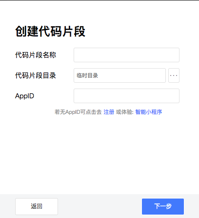
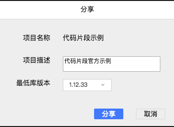

代码片段本质上是一种轻量级的、便于分享的智能小程序项目，在帮助开发者们快速交流的同时还能丰富用户文档。

## 创建代码片段
1. 打开开发者工具，在菜单栏单击“项目>新建代码片段”。

2. 在对话框内填入“代码片段名称”、“代码片段目录”和“AppID”。
3. 单击“下一步”，完成创建并打开代码片段。

**说明**：
为便于小程序的代码片段的传播，代码片段体积不得大于100K。

## 分享代码片段
1. 单击图中右上角双箭头，选择“分享”。

2. 在对话框中填写项目描述，并选择基础库的最低版本。
3. 单击“分享”生成链接。

4. 单击“复制”，即可分享给其他开发者。

## 导入代码片段

* 在浏览器中直接输入分享链接，例如：`swanide://fragment/58843847314c5aca684e0ec20a920243` 。
* 打开开发者工具，在菜单栏单击“栏目>导入代码片段”并填写对应的“代码片段名称”和“代码片段目录”进行导入。