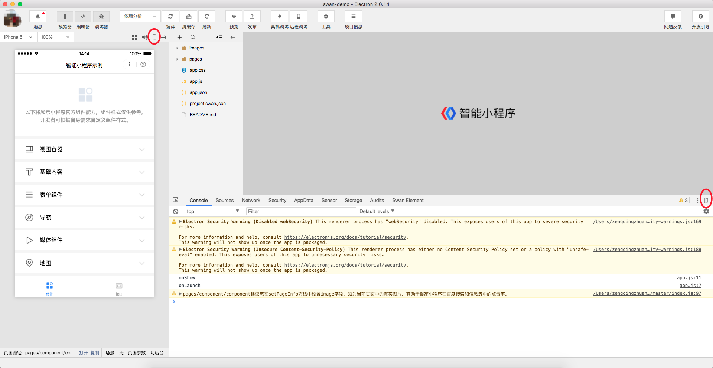
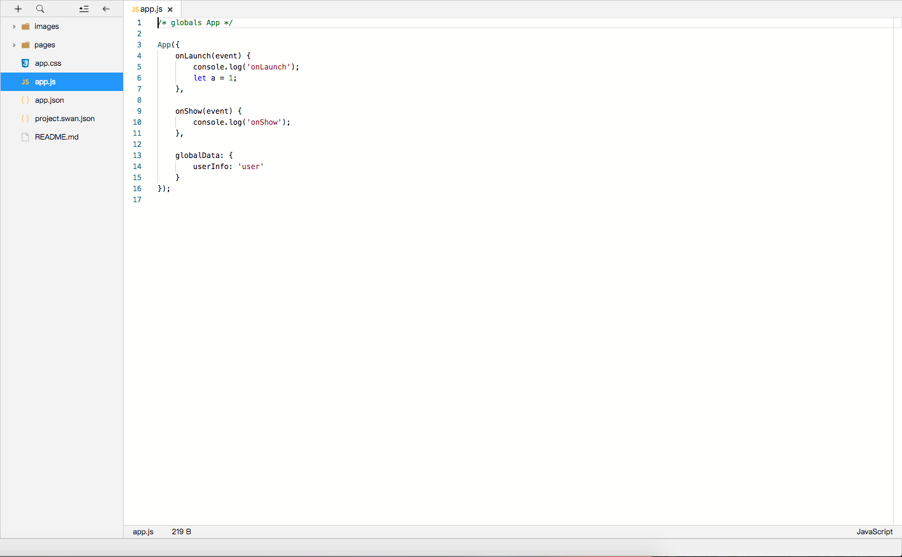
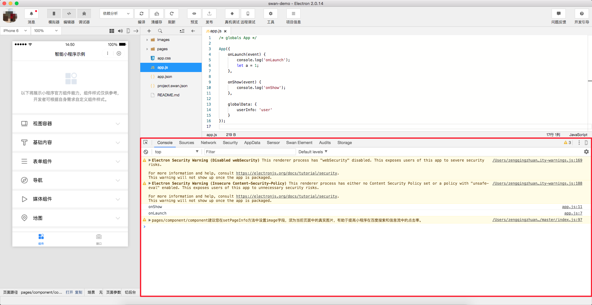

  

## 工具栏

点击用户头像可以切换账号，点击消息可以查看开发者工具收到的消息。

    

        
    

    

        
    
     

* 模拟器、编辑器、调试器按钮：控制主界面模块显示/隐藏。至少需要一个模块显示。
* 编译按钮：可以设置智能小程序的进入场景、页面参数、进入的页面路径等调试参数。
* 清缓存按钮：可以便捷的清除工具上的文件缓存、数据缓存、授权缓存和登录状态，方便开发者调试。
* 刷新按钮：点击可以刷新模拟器。
* 预览按钮：本地编译产出上传至服务器后生成小程序以及 web 小程序二维码，使用百度App扫码即可查看。
* 发布按钮：点击发布成功后可以生成体验版以及提交审核，需要登录官网查看。
* 真机调试按钮：启动真机调试。
* 远程调试按钮：启动远程调试。
* 项目信息按钮：可以查看项目的详细信息。
* 工具按钮：可以进行白屏检测操作。

### 工具栏管理
在工具栏上点击鼠标右键，可以打开工具栏管理

## 模拟器

模拟器可以模拟智能小程序在百度 App 的表现。智能小程序的代码通过编译后可以在模拟器上直接运行。
开发者可以选择不同的设备，也可以添加自定义设备来调试智能小程序在不同尺寸机型上的适配问题。
模拟器底部的切后台按钮可以模拟移动设备切换窗口的操作。

    

        
    

    

        
    
     

### 独立窗口
因为有不少开发者基于小程序三方框架接入，一般都用自己的编辑器开发，只用开发者工具看效果和调试，所以我们把编辑器和模拟器作为独立窗口弹出。
点击 模拟器/调试器 右上角的按钮可以使用独立窗口显示 模拟器/调试器。

## 编辑器
编辑器可以对当前项目进行代码编写和文件的添加、删除以及重命名等基本操作。

## 调试器
提供查看组件树、console、查看源文件、查看网络请求、查看storage等功能
