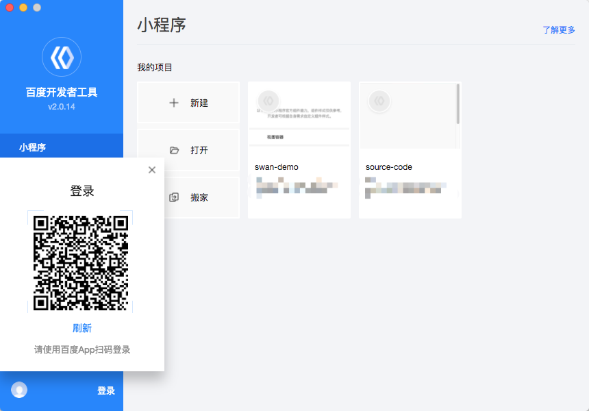
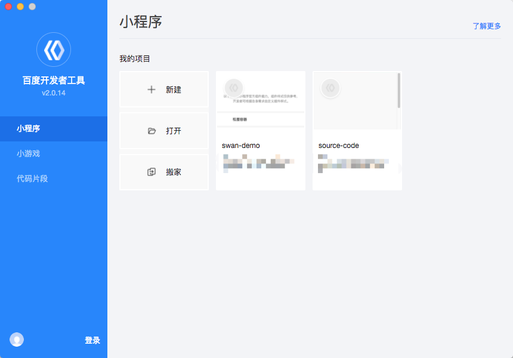
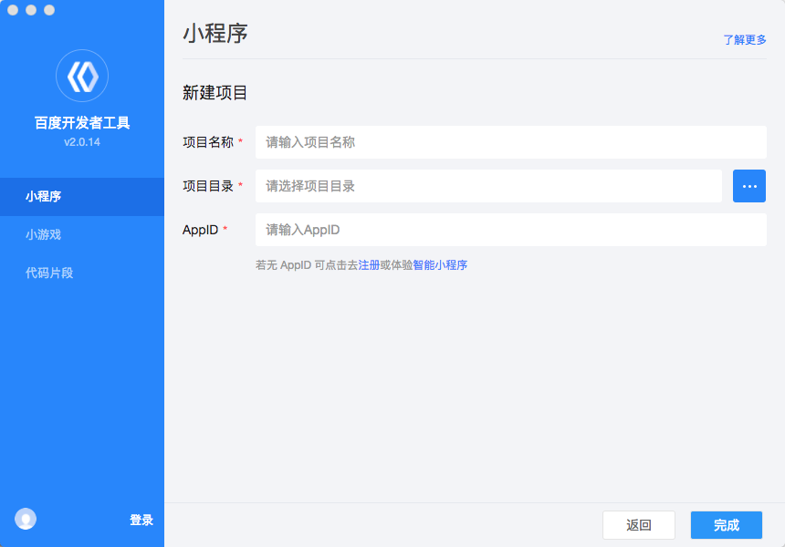
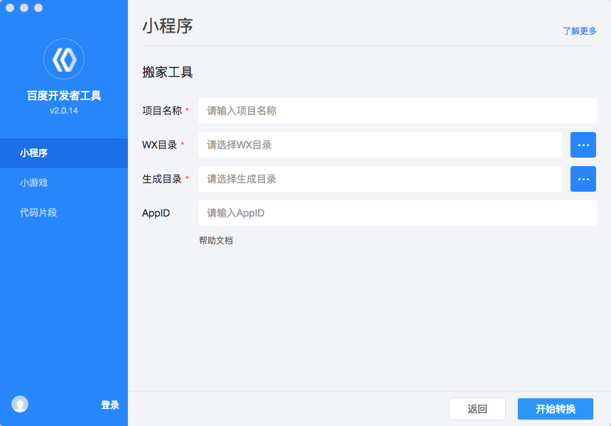
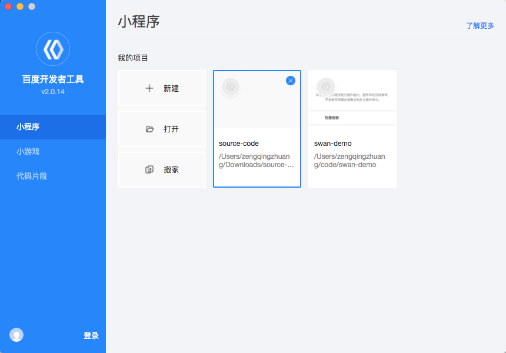
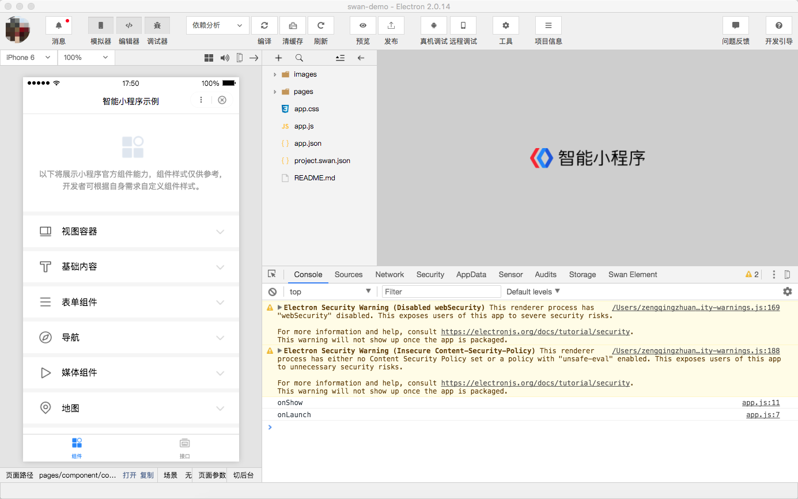
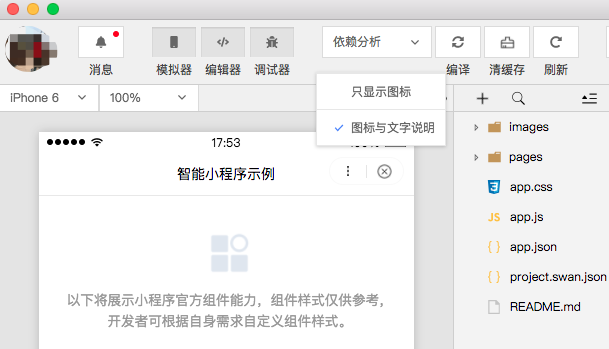
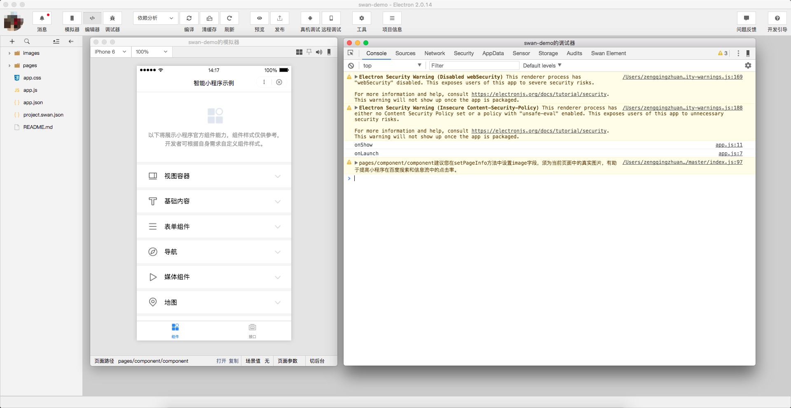

## 登录页

在启动页面左下角点击登录按钮，弹出登录页，可以使用百度APP扫码登录开发者工具，开发者工具将使用这个百度帐号的信息进行小程序的开发和调试。

### 项目列表

可以看到已经打开过的小程序、小游戏、代码片段的项目列表

### 新建项目

新建项目需要开发者填写项目的名称、项目目录和 AppID。信息校验无误后会自动生成一个空白的智能小程序工程。

    1、如果开发者尚没有 AppID 可以点击'注册'，注册 AppID 或者点击'智能小程序'选择体验模式，但体验模式下，部分 API 可能无法正常调用。
    2、登录的百度账号需要是该 AppID 的开发者。
    3、如果选择一个空目录，会直接创建在该目录下；如果选择一个非空目录，会提示此路径下已存在项目，是否确认覆盖。

 

### 搬家工具
百度开发者工具提供了将微信小程序转换为百度智能小程序的功能，详情参考： https://smartprogram.baidu.com/docs/develop/tutorial/move/

### 多开项目
工具支持同时打开多个项目，每次打开项目时会从新窗口打开，入口有以下几种：

    1、从启动页打开项目，处于项目窗口时可以从菜单栏的项目 -> 查看所有项目打开启动页
    2、从菜单栏的最近打开项目列表中打开的项目会从新窗口打开
    3、新建项目

### 管理项目
对本地项目进行删除

 

## 菜单栏

#### 百度开发者工具

* 切换帐号：快速切换登录用户
* 关于：关于开发者工具
* 检查更新：检查版本更新
* 调试：调试开发者工具；如果遇到疑似开发者工具的 bug，可以打开调试工具查看是否有出错日志，欢迎在论坛上反馈相关问题
* 退出：退出开发者工具

#### 项目

* 打开最近项目：可以查看最近打开的项目列表，并选择是否进入对应项目
* 新建项目：快速创建项目
* 导入项目：选择项目目录，快速导入项目
* 创建代码片段：快速创建代码片段
* 导入代码片段：选择项目目录，快速导入代码片段
* 查看所有项目：新窗口打开启动页的项目列表页

#### 文件

* 新建文件
* 保存文件
* 保存所有
* 关闭文件

#### 编辑

* 剪切
* 复制
* 粘贴
* 粘贴并匹配样式
* 全选
* 撤销
* 重做
* 左缩进
* 右缩进
* 格式化代码
* 代码上移一行
* 代码下移一行
* 复制并向上粘贴
* 复制并向下粘贴
* 跳转到文件
* 上一个编辑器
* 下一个编辑器
* 全局查找
* 查找/替换
* 开始听写...
* 表情与符号

#### 查看

* 工具栏：控制工具栏显示和隐藏
* 调试器：控制调试器显示和隐藏
* 模拟器：控制模拟器显示和隐藏
* 编辑器：控制编辑器显示和隐藏
* 目录树：控制项目目录显示和隐藏

#### 开发

* 预览：预览小程序项目
* 发布：发布小程序代码
* 刷新：刷新模拟器
* 编译：编译小程序项目
* 编译配置：切换编译模式、添加自定义编译模式
* 前后台切换：模拟客户端小程序进入后台运行和返回前台的操作
* 清除缓存：清除文件缓存、数据缓存以及授权数据

#### 工具

* 真机调试：通过网络连接，对手机上运行的小程序进行调试
* 远程调试：使用手机扫描此二维码，即可开始远程调试。
* 云测试：免费的云真机测试环境
* 多设备调试：打开多个主窗口
* 工具栏管理：控制工具栏展示状态

#### 窗口

* 最小化窗口
* 关闭窗口

#### 设置

* 快捷键设置：快捷键操作设置
* 编辑设置：控制文件保存的行为，编辑器的表现
* 代理设置：选择直接连接、手动设置代理

#### 帮助

* 一键修复：修复编译进程异常退出的情况
* 开发者文档
* 开发者社区
* 问题反馈
* 发布历史

## 工具栏

点击用户头像可以切换账号，点击消息可以查看开发者工具收到的消息。

    

        
    

    

        
    
     

* 模拟器、编辑器、调试器按钮：控制主界面模块显示/隐藏。至少需要一个模块显示。
* 编译按钮：可以设置智能小程序的进入场景、页面参数、进入的页面路径等调试参数。
* 清缓存按钮：可以便捷的清除工具上的文件缓存、数据缓存、授权缓存和登录状态，方便开发者调试。
* 刷新按钮：点击可以刷新模拟器。
* 预览按钮：本地编译产出上传至服务器后生成小程序以及 web 小程序二维码，使用百度App扫码即可查看。
* 发布按钮：点击发布成功后可以生成体验版以及提交审核，需要登录官网查看。
* 真机调试按钮：启动真机调试。
* 远程调试按钮：启动远程调试。
* 项目信息按钮：可以查看项目的详细信息。
* 工具按钮：可以进行白屏检测操作。

### 工具栏管理
在工具栏上点击鼠标右键，可以打开工具栏管理

## 模拟器

模拟器可以模拟智能小程序在百度 App 的表现。智能小程序的代码通过编译后可以在模拟器上直接运行。
开发者可以选择不同的设备，也可以添加自定义设备来调试智能小程序在不同尺寸机型上的适配问题。
模拟器底部的切后台按钮可以模拟移动设备切换窗口的操作。

    

        
    

    

        
    
     

### 独立窗口
点击 模拟器/调试器 右上角的按钮可以使用独立窗口显示 模拟器/调试器

## 编辑器
编辑器可以对当前项目进行代码编写和文件的添加、删除以及重命名等基本操作。

## 调试器
提供查看组件树、console、查看源文件、查看网络请求、查看storage等功能
