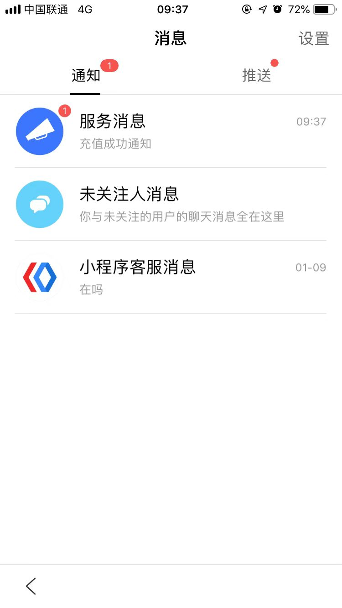
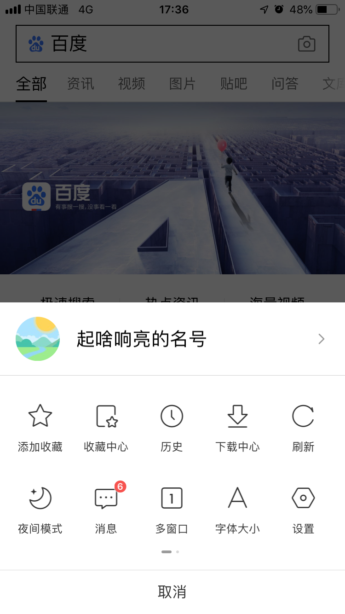
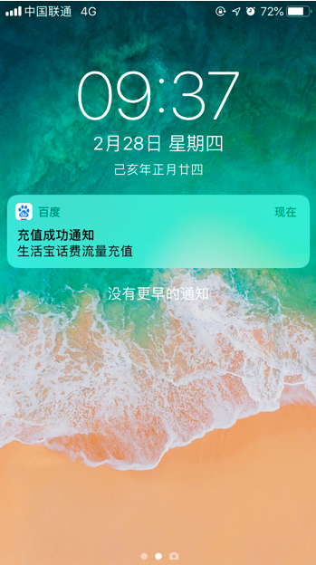
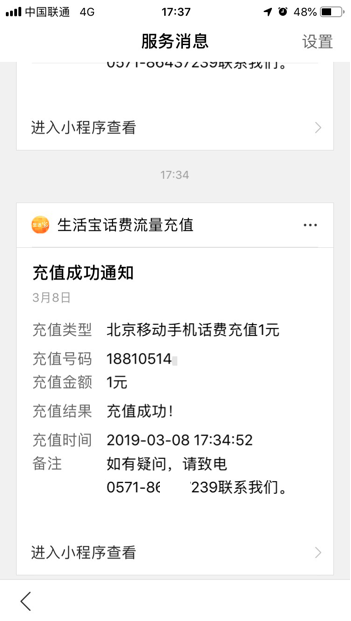
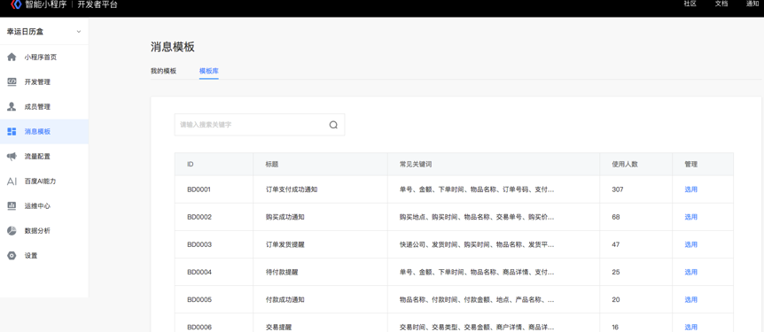
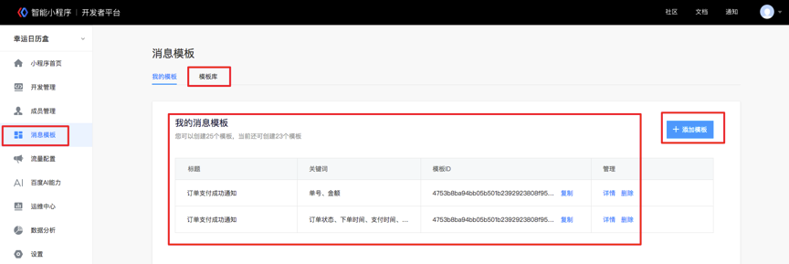
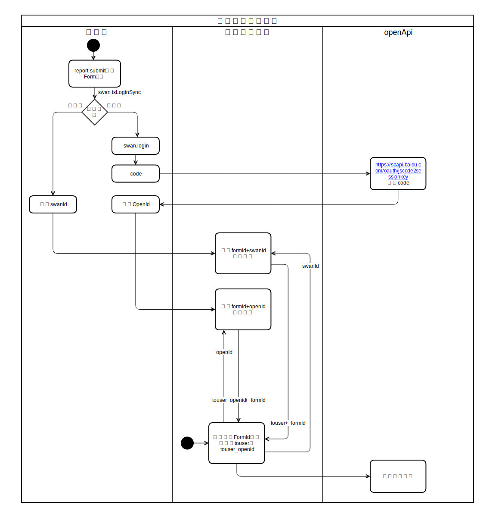

## 使用场景
模板消息可以方便开发者更高效的触达用户，例如：交易状态、物流状态，订单评价等；用户在小程序内产生交互行为后，开发者可以通过用户交互行为产生的凭证配置模板消息来发送给用户。
> 目前模板消息仅支持文本消息。

## 功能介绍
目前已经开放的模板消息主要是两类：支付类和表单类消息。
> 两种类型的下发条件有所差异，详见<a href="http://smartprogram.baidu.com/docs/develop/serverapi/open_infomation/#%E4%B8%8B%E5%8F%91%E6%9D%A1%E4%BB%B6%E8%AF%B4%E6%98%8E/">下发条件说明</a>。

### 消息的入口

* 百度App-我的tab-消息中心
    > 支付、表单消息均有该入口。

<!-- 
 -->

<div class="m-doc-custom-examples">
	<div class="m-doc-custom-examples-correct">
		
		<!-- <p class="m-doc-custom-examples-title">正确</p><p class="m-doc-custom-examples-text">内容左右边距应至少34px(17pt)。</p> -->
	</div>
	<div class="m-doc-custom-examples-error ">
		
		<!-- <p class="m-doc-custom-examples-title">错误</p><p class="m-doc-custom-examples-text">边距过宽，页面元素过于集中。</p> -->
	</div>
</div>

* 搜索结果页菜单面板
    > 支付、表单类消息均有该入口。

<div class="m-doc-custom-examples">
	<div class="m-doc-custom-examples-correct">
		
		<!-- <p class="m-doc-custom-examples-title">正确</p><p class="m-doc-custom-examples-text">内容左右边距应至少34px(17pt)。</p> -->
	</div>
	<div class="m-doc-custom-examples-error ">
		
		<!-- <p class="m-doc-custom-examples-title">错误</p><p class="m-doc-custom-examples-text">边距过宽，页面元素过于集中。</p> -->
	</div>
</div>
<!-- 
 -->
* 手机通知栏
    > 仅限支付消息，部分Android厂商机型可能受限。

    
* 模板消息体的样式示意：

    

## 使用说明

### 步骤一： 选用模板，获取模板ID
打开开发者平台选择“消息模板”，在“模板库”列表页可选择对应的模板消息，也可以通过搜索关键词来查找想要的消息模板。如果没有合适的模板消息关键词，可以申请新增关键词，审核通过后即可使用。
添加模板完成后，可以在我的模板里看到对应模板的模板ID。



### 步骤二：通过<a href="http://smartprogram.baidu.com/docs/develop/component/formlist/#form/">form</a>组件获取 formId 或者通过支付获取 <a href="http://dianshang.baidu.com/platform/doclist/index.html#!/doc/nuomiplus_1_guide/mini_program_cashier/standard_interface/push_notice.md">orderId</a> 或者 payId。


#### formid 
页面的`<form/>`组件，属性report-submit为true时，可以声明为需发模板消息，此时用户点击按钮提交表单可以获取formId，用于发送表单类模板消息。

#### orderId
当用户通过百度收银台支付后，开发者可以在收银台接口通知支付状态通知参数中获取到orderId 用于发送交易类模板消息。

#### payId 
当用户通过直连（微信、支付宝）支付等完成支付行为时，可以获取payId用于发送交易类模板消息。

### 步骤三：调用接口下发模板消息

* 获取小程序模板库标题列表:<a href="https://smartprogram.baidu.com/docs/develop/serverapi/open_infomation/#getTemplateLibraryList/">getTemplateLibraryList</a>
* 获取模板库某个模板标题下的关键词库:<a href="https://smartprogram.baidu.com/docs/develop/serverapi/open_infomation/#getTemplateLibraryById/">getTemplateLibraryById</a>
* 组合模板并添加至帐号下的个人模板库:<a href="https://smartprogram.baidu.com/docs/develop/serverapi/open_infomation/#addTemplate/">addTemplate</a>
* 获取帐号下已存在的模板列表:<a href="https://smartprogram.baidu.com/docs/develop/serverapi/open_infomation/#getTemplateList/">getTemplateList</a>
* 删除帐号下的某个模板:<a href="https://smartprogram.baidu.com/docs/develop/serverapi/open_infomation/#deleteTemplate/">deleteTemplate</a>
* 推送模板消息:<a href="https://smartprogram.baidu.com/docs/develop/serverapi/open_infomation/#sendTemplateMessage/">sendTemplateMessage</a>


## 下发条件说明

### 表单类消息

对于在智能小程序内发生过提交表单行为且该表单声明要发送模板消息的用户，当开发者需要向用户提供服务时，可允许开发者向用户在 7 天内推送有限条数的模板消息。
> 1次提交表单可下发 1 条，多次提交下发条数独立，相互不影响。

### 支付类消息
对于在智能小程序内完成过支付行为的用户，可允许开发者向用户在 7 天内推送有限条数的模板消息。
> 1次支付可下发3条，多次支付下发的条数独立，互不影响。


## getTemplateLibraryList 
**解释**：获取小程序模板库标题列表。
**接口调用请求说明**：
```
POST https://openapi.baidu.com/rest/2.0/smartapp/template/librarylist?access_token=ACCESS_TOKEN
```

**参数说明**:

|参数名|	类型|	是否必须|	描述|
|---|---|---|---|
|offset|	int|	是|	偏移数量|
|count|	int|	是|	返回长度，取值区间（0，20]。|
|access_token|string	|是|	<a href="https://smartprogram.baidu.com/docs/develop/serverapi/power_exp/">接口调用凭证</a>|

**返回值**:
```json
{
    "errno": 0,
    "msg": "success",
    "data": {
        "total_count": 2278,
        "list": [
            {
                "id": "BD0001",
                "title": "订单支付成功通知"
            },
            {
                "id": "BD0002",
                "title": "购买成功通知"
            },
            {
                "id": "BD0003",
                "title": "订单发货提醒"
            },
            {
                "id": "BD0004",
                "title": "待付款提醒"
            },
            {
                "id": "BD0005",
                "title": "付款成功通知"
            }
        ]
    }
}
```
## getTemplateLibraryById 
**解释**：获取模板库某个模板标题下的关键词库。
**接口调用请求说明**：

``` 
POST https://openapi.baidu.com/rest/2.0/smartapp/template/libraryget?access_token=ACCESS_TOKEN
```

**参数说明**

|参数名|	类型|	是否必须|	描述|
|---|---|---|---|
|id	|string|	是|	模板库id|
返回值
```json
{
    "errno": 0,
    "msg": "success",
    "data": {
        "id": "BD0016",
        "title": "取票成功通知",
        "keyword_count": 13,
        "keyword_list": [
            {
                "keyword_id": 1,
                "name": "金额",
                "example": "300元"
            },
            {
                "keyword_id": 2,
                "name": "订单号",
                "example": "321254555"
            },
            {
                "keyword_id": 3,
                "name": "预订时间",
                "example": "2016年9月9日 10：10"
            },
            {
                "keyword_id": 4,
                "name": "发车时间",
                "example": "2016年9月10日 10：20"
            },
            {
                "keyword_id": 5,
                "name": "出发地",
                "example": "广州"
            },
            {
                "keyword_id": 6,
                "name": "目的地",
                "example": "北京"
            },
            {
                "keyword_id": 7,
                "name": "备注",
                "example": "请尽快完成支付"
            },
            {
                "keyword_id": 8,
                "name": "上车地点",
                "example": "3号口"
            },
            {
                "keyword_id": 9,
                "name": "车牌号",
                "example": "粤A00951"
            },
            {
                "keyword_id": 10,
                "name": "司机姓名",
                "example": "王师傅"
            },
            {
                "keyword_id": 11,
                "name": "手机号码",
                "example": "15201912039"
            },
            {
                "keyword_id": 12,
                "name": "联系人",
                "example": "张三"
            },
            {
                "keyword_id": 13,
                "name": "坐席类型",
                "example": "一等座"
            }
        ]
    }
}
```
## addTemplate
**解释**：组合模板并添加至帐号下的个人模板库。
**接口调用请求说明**:
```
POST https://openapi.baidu.com/rest/2.0/smartapp/template/templateadd?access_token=ACCESS_TOKEN
```
**参数说明**:

|参数名|	类型|	是否必须|	描述|
|---|---|---|---|
|id|	string|	是|	模板库id|
|keyword_id_list|	json|	是|	模板关键词id列表，如[1,2,3]；keyid 数目取值区间[2,6] 。|
**返回值**:
```json
{
    "errno": 0,
    "msg": "success",
    "data": {
        "template_id": "f34178cd598201d9dc8d5c88cd87b44cf7cd0e62NwmP" 
    }
}
```
## getTemplateList
**解释**：获取帐号下已存在的模板列表。
**接口调用请求说明**：
```
POST https://openapi.baidu.com/rest/2.0/smartapp/template/templatelist?access_token=ACCESS_TOKEN
```
**参数说明**:

|参数名|	类型|	是否必须|	描述|
|---|---|---|---|
|offset|	int|	是|	偏移量|
|count|	int|	是|	数量|
**返回值**:
```json
{
    "errno": 0,
    "msg": "success",
    "data": {
        "total_count": 2,
        "list": [
            {
                "template_id": "e4313219538c4b0262e3a14a0507000e8bd79e9PTPAz",
                "title": "续费成功通知",
                "content": "购买时间{{keyword1.DATA}}\n物品名称{{keyword2.DATA}}",
                "example": "购买时间: 2016年6月6日\n物品名称: 奶茶"
            },
            {
                "template_id": "f34178cd598201d9dc8d5c88cd87b44cf7cd0e64d90Y",
                "title": "续费成功通知",
                "content": "购买时间{{keyword1.DATA}}\n物品名称{{keyword2.DATA}}",
                "example": "购买时间: 2016年6月6日\n物品名称: 奶茶"
            }
        ]
    }
}
```
## deleteTemplate 
**解释**：删除帐号下的某个模板。
**接口调用请求说明**:
```
POST https://openapi.baidu.com/rest/2.0/smartapp/template/templatedel?access_token=ACCESS_TOKEN
```
**参数说明**:

|参数名|	类型|	是否必须|	描述|
|---|---|---|---|
|template_id|	string|	是|	模板id|
**返回值**:
```json
{
    "errno": 0,
    "msg": "success",
    "data": []
}
```


## sendTemplateMessage

**解释：**推送模板消息

**接口调用请求说明：**请提前在开发者平台创建消息模板。用`application/x-www-form-urlencoded`方式提交数据。

```
POST https://openapi.baidu.com/rest/2.0/smartapp/template/send?access_token=ACCESS_TOKEN

```


**名词解释：**

- [swan_id](http://smartprogram.baidu.com/docs/develop/api/open_userinfo/#swanid%E6%9C%BA%E5%88%B6%E8%AF%B4%E6%98%8E/)：百度生成的与设备相关的唯一标识，APP卸载重安装不会变 
- open_id：百度用户登录唯一标识
- formId：[form_id官方文档介绍](https://smartprogram.baidu.com/docs/develop/component/formlist/#form/)

**参数说明：**

| 参数名            | 类型      | 是否必须 | 描述   |
|----|--|------|-----|
| access\_token  | String  | 是    | [接口调用凭证](https://smartprogram.baidu.com/docs/develop/serverapi/power_exp/)|
| touser         | String  | 是    | 接收者swan\_id，与touser\_openId二选一 （使用方式参考下面规则）|
| touser\_openId | String  | 是    | 接收者open\_id，与touser 二选一（使用方式参考下面规则） |
| template\_id   | String  | 是    | 所需下发的模板消息的id  |
| data           | Objec   | 是    | \{"keyword1": \{"value": "2018\-09\-06"\},"keyword2": \{"value": "kfc"\}\}为json对象 |
| page           | String  | 否    | 跳转小程序页面地址 pages/xxx/xxx?f=xxxx   |
| scene\_id      | String  | 是    | 表单提交场景下，为 submit 事件带上的 formId；支付场景下，为本次支付的 payId、orderId   |
| scene\_type    | Integer | 是    | 场景id类型，1：表单；2：百度收银台订单；3:直连订单        |
| ext            | Object  | 否    | \{"xzh\_id":111,"category\_id":15\}      |

**touser&touser_openId使用规则说明：**

- 百度登录用户使用touser_openId，游客用户使用touser，详见[如何判断当前用户是游客状态还是登陆状态](#如何判断当前用户是游客状态还是登陆状态？)。

### Q&A

 
#### 如何判断当前用户是游客状态还是登陆状态？
 - scene_id最后一位是 1 代表登录状态, 最后一位是 0 代表未登陆游客状态
 - 通过[swan.isLoginSync](http://smartprogram.baidu.com/docs/develop/api/open_log/#swan-isLoginSync/) API可以判断当前用户是否为登陆状态
 
#### 如何获取swan\_id & open\_id？
 - 获取swan\_id：[swan.getSwanId](https://smartprogram.baidu.com/docs/develop/api/open_userinfo/#swan-getSwanId/)
 - 获取open\_id：参考官方文档 [获取登录用户OpenId](https://smartprogram.baidu.com/docs/develop/api/open_log/)
 

### 模板消息开发流程图：



### 错误码

| 错误码  | 说明               |
|-------|------------------|
| 2002 | 参数错误             |
| 4001 | template\_id 不正确 |
| 4002 | 消息推送接口调用失败       |
| 4003 | 表单无效             |
| 4004 | 场景id无效           |
| 6001 | 无 push 权限        |
