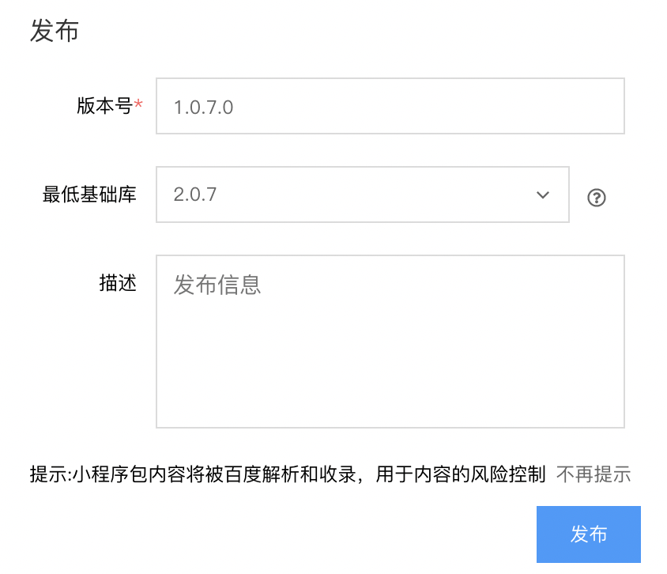

随着智能小程序版本的不断更新，组件和 API 能力正在逐步完善和丰富，旧版本的客户端会出现不支持新增功能的情况，因此在使用这些新功能的时候要进行兼容处理。通常我们会使用版本号比较、API存在判断、swan.canIUse三种方式来处理兼容。如果由于业务需求，无法在低版本的基础库上运行小程序的话，还可以设置最低基础库来让小程序在低于最低基础库版本的客户端上提示用户升级。

## 版本号比较 
智能小程序客户端和智能小程序基础库版本号风格为 Major.Minor.Patch（主版本号.次版本号.修订号），可以通过通过 <a href="http://smartprogram.baidu.com/docs/develop/api/device_sys/#getSystemInfo/">swan.getSystemInfo </a>或者 <a href="http://smartprogram.baidu.com/docs/develop/api/device_sys/#getSystemInfoSync/">swan.getSystemInfoSync</a> 方法返回的 SDKVersion 字段来获取。 智能小程序的 API 和组件会标明支持的基础库版本，开发者可以比较基础库版本号来进行兼容，这通常可以兼容所有情况，对于API和组件的兼容也可以考虑后面提供的其他方法。
版本号比较可以参考下面的方法来判断：

```js
function compareVersion(v1, v2) {
  v1 = v1.split('.')
  v2 = v2.split('.')
  var len = Math.max(v1.length, v2.length)

  while (v1.length < len) {
    v1.push('0')
  }
  while (v2.length < len) {
    v2.push('0')
  }

  for (var i = 0; i < len; i++) {
    var num1 = parseInt(v1[i])
    var num2 = parseInt(v2[i])

    if (num1 > num2) {
      return 1
    } else if (num1 < num2) {
      return -1
    }
  }

  return 0
}

compareVersion('1.11.0', '1.9.9')
// 1
```

**注意: **
此方法同样适用于判断百度 App版本，但在不得不使用百度 App版本进行判断兼容的情况下，请使用 SWAN 版本进行判断兼容。


## API存在判断
一般来说，对于新增的API，开发者可以用以下代码来判断新增API是否支持用户的客户端：
```js
if (swan.createCanvasContext) {
  swan.createCanvasContext()
}
else {
  swan.showModal({
    title: '提示',
    content: '当前客户端版本过低，无法使用该功能，请升级。'
  })
}
```
## canIUse
### 兼容api新增属性或返回值
开发者可以用以下代码判断 API 的参数或者返回值是否有新增：
```js
swan.showModal({
  success: function(res) {
    if (swan.canIUse('showModal.cancel')) {
      console.log(res.cancel)
    }
  }
})
```
### 兼容组件
由于新增的组件或属性在旧版本上是否既不会被处理，也不会报错。开发者可以用以下代码对旧版本进行降级处理：
```js
Page({
  data: {
    canIUse: swan.canIUse('cover-view')
  }
})
<video controls="{{!canIUse}}">
  <cover-view s-if="{{canIUse}}">play</cover-view>
</video>
```
## Android 与 iOS 差异

|功能|Andriod|iOS|
|--|--|--|
|webp格式|支持|不支持|


## 基础库最低版本设置

当开发者由于业务需要，开发者不希望小程序在低版本的基础库上运行时，可以通过设置最低基础库版本来解决，设置最低基础库通常会损失一部分用户，用户分布可以通过[版本分布](https://smartprogram.baidu.com/docs/develop/swan/version/)来查看。
如：小程序 A 希望使用导航栏的自定义导航栏功能，由于这个功能在 2.10.7 的基础库才开始支持，开发者不希望在低版本客户端上让用户看到不完美的效果，就可以在发布小程序时设置最低基础库版本为 2.10.7。在版本分布页面可以看到，2.10的基础库覆盖率为98.7%，所以设置了最低版本后会损失1.3%的用户。




设置最低基础库版本后，你的小程序若在低于设置值的百度APP上打开时，首先会尝试寻找之前是否发布过可以支持此基础库的小程序，没有的话会提示用户更新客户端版本。智能小程序最低基础库的设置是跟随发布的版本一起生效的，即发布时设置当前发布的版本，不支持发布后的更新。 
举个例子：开发者发布的第一个小程序版本a，最低基础库版本设置为3.50.0，又发布了最低基础库版本为3.60.0的新版本b。在百度APP11.0上打开小程序时，会提示用户升级手百；在百度APP 11.6.0版本上打开小程序时，会打开版本a小程序；在百度APP 11.9.0版本上打开该小程序时，会打开版本b小程序。

